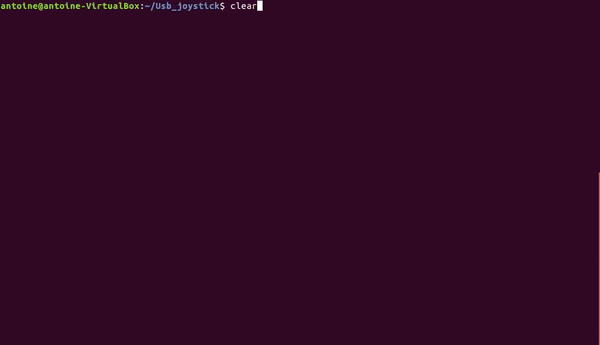

# Tutorat Système (IMA4 - 2017/2018)

#### **SimpleSnake** | Contrôle d'un jeu à l'aide d'un périphérique USB 

> Projet réalisé par Anthony DUROT & Antoine DUQUENOY (Arduino 3)
>
> Utilisation de libusb, LUFA et Ncurses

## Présentation

Cette version du jeu Snake est jouable à 1 ou 2 joueurs et la taille de l'environnement du jeu dépend simplement de la taille du terminal (il est possible de redimensionner en cours de partie mais les bonus à l'extérieur seront perdus). Le Joueur 1 contrôle son snake avec la manette et en cas de partie à deux, le Joueur 2 utilisera les flèches directionnelles du clavier. Dernière précision, les murs tuent.

  

## Procédure de lancement

- Assurez-vous de disposer des droits utilisateurs (requis par libusb).
- Lancez le script `play.sh` qui se charge d'installer Ncurses et de compiler les sources.
- Le premier menu est utilisable avec la manette (bouton du joystick pour confirmer) et le second requiert l'utilisation du clavier (`ENTRER` pour valider).
- Jouez !

## Périphérique non reconnu ?

* Se rendre dans le dossier `Usb_joystick/AT16u2/PolytechLille/PAD`.
* Lancez le script `upload.sh`.
* Débranchez et rebranchez la manette.

## Précisions sur le projet

* Le programme de l'Atmega328p est réalisé par interruptions (boutons et réception USART0).
* L'Atmega16u2 utilise le vecteur d'interruption de réception de l'USART1.
* Le transfert USB s'effectue dans les deux sens, un appuie sur le bouton `PAUSE` de la manette entraine l'allumage de la LED.

#### Protocole USB

|      Endpoint IN       |     Enpoint OUT      |
| :--------------------: | :------------------: |
|   Bouton haut : `36`   | Allumage LED : `49`  |
|  Bouton droit : `34`   | Eteignage LED : `48` |
|   Bouton bas : `40`    |                      |
|  Bouton gauche : `48`  |                      |
| Bouton joystick : `33` |                      |

#### Protocole Série

Même protocole que celui d'USB.
